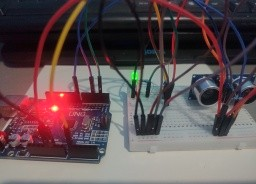
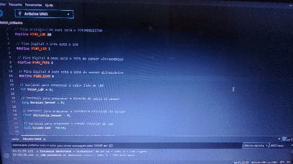
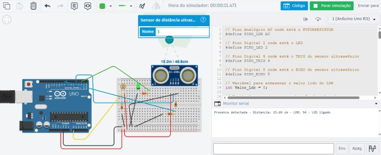
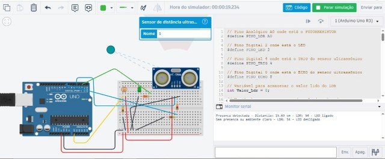

# 💡 Luz-Automatica-LDR-Ultrassonico-Arduino-Uno

Luz automática com Arduino Uno que acende um LED quando detecta alguém por perto e o ambiente está escuro, usando sensor ultrassônico e fotorresistor (LDR). O mesmo código foi testado no simulador Tinkercad e no hardware real.

---

## 📋 Sobre o projeto

A ideia foi simular a luz de uma sala ou de um escritório que acende sozinha: o sensor ultrassônico HC-SR04 detecta a aproximação de uma pessoa e o LDR confirma se o ambiente está escuro. A luz só acende quando as duas condições acontecem ao mesmo tempo.

O destaque do projeto é que o **mesmo código** foi validado em dois ambientes:

- **Simulação no Tinkercad.**
- **Hardware físico**, com Arduino Uno e os componentes reais, lido pelo Monitor Serial no notebook.

O projeto foi feito como parte do meu portfólio prático de sistemas embarcados.

▶️ [Abrir a simulação no Tinkercad](https://www.tinkercad.com/things/0fqYZkSWwtI-sensor-ldr)

---

## 🛠 Ferramentas utilizadas

### Simulação
- Tinkercad Circuits

### Hardware físico
- Arduino Uno
- Protoboard
- Sensor ultrassônico HC-SR04
- Fotorresistor (LDR)
- 1 LED verde
- Resistor de 10 kΩ (divisor de tensão do LDR)
- Resistor de 220 Ω (LED)
- Resistores de 1 kΩ e 2 kΩ (divisor de tensão do ECHO)
- Jumpers
- Notebook com Monitor Serial

### Software
- Linguagem C++ (Arduino)

---

## 🏗 O que foi montado

O circuito tem três blocos:

- **Sensor ultrassônico HC-SR04:** TRIG no pino 4 e ECHO no pino 8. O ECHO passa por um divisor de tensão com resistores de 1 kΩ e 2 kΩ, que reduz o sinal de 5 V para cerca de 3,3 V.
- **LDR:** ligado em série com um resistor de 10 kΩ ao GND, formando um divisor de tensão. O ponto central é lido pela entrada analógica A0.
- **LED:** ligado ao pino 2 com um resistor de 220 Ω em série.

### Pinagem

| Componente | Pino do Arduino Uno |
|---|---|
| LDR (divisor de tensão) | A0 |
| LED | 2 |
| TRIG do HC-SR04 | 4 |
| ECHO do HC-SR04 | 8 |

---

## 🔧 Como funciona

1. A cada 100 ms o Arduino lê o LDR e mede a distância com o ultrassônico. O tempo é controlado com `millis()`, sem `delay()` entre as leituras.
2. A distância é calculada em centímetros pelo tempo de retorno do som:

```
distância = duração × 0,0343 / 2
```

3. A presença é decidida com uma faixa de histerese, para o LED não ficar piscando na borda:

| Distância | O que acontece |
|---|---|
| Entre 10 cm e 40 cm | Presença detectada |
| 60 cm ou mais | Presença desligada |
| Abaixo de 10 cm ou entre 40 e 60 cm | Mantém o estado anterior |

4. O LED só acende se houver presença **e** o ambiente estiver escuro (leitura do LDR abaixo de 500).
5. O Monitor Serial só imprime mensagem quando o estado do LED muda, o que deixa a saída limpa e fácil de ler.

---

## 💻 Código

```cpp
// Luz-Automatica-LDR-Ultrassonico-Arduino-Uno

// Pino Analógico A0 onde está o FOTORRESISTOR
#define PINO_LDR A0

// Pino Digital 2 onde está o LED
#define PINO_LED 2

// Pino Digital 4 onde está o TRIG do sensor ultrassônico
#define PINO_TRIG 4

// Pino Digital 8 onde está o ECHO do sensor ultrassônico
#define PINO_ECHO 8

// Variável para armazenar o valor lido do LDR
int Valor_Ldr = 0;

// Variável para armazenar a duração do pulso do sensor
long Duracao_Sensor = 0;

// Variável para armazenar a distância calculada do sensor
float Distancia_Sensor = 0;

// Variável para armazenar o estado anterior do LED
bool Estado_Led = false;

// Variável para armazenar o tempo da última leitura
unsigned long Tempo_Anterior = 0;

// Intervalo entre as leituras em milissegundos
unsigned long Intervalo = 100;

// Variável para armazenar o estado da presença
bool Presenca_Sensor = false;

// Variável para armazenar o novo estado do LED
bool Novo_Estado_Led = false;

void setup()
{
    // Inicializa a comunicação serial
    Serial.begin(9600);

    // Configura o pino do LED como saída
    pinMode(PINO_LED, OUTPUT);

    // Configura o pino TRIG como saída
    pinMode(PINO_TRIG, OUTPUT);

    // Configura o pino ECHO como entrada
    pinMode(PINO_ECHO, INPUT);
}

void loop()
{
    // Verifica se já passou o intervalo definido
    if (millis() - Tempo_Anterior >= Intervalo)
    {
        // Atualiza o tempo da última leitura
        Tempo_Anterior = millis();

        // Lê o valor do LDR
        Valor_Ldr = analogRead(PINO_LDR);

        // Envia o pulso para o sensor ultrassônico
        digitalWrite(PINO_TRIG, LOW);
        delayMicroseconds(2);

        digitalWrite(PINO_TRIG, HIGH);
        delayMicroseconds(10);

        digitalWrite(PINO_TRIG, LOW);

        // Mede o tempo de retorno do sinal
        Duracao_Sensor = pulseIn(PINO_ECHO, HIGH);

        // Calcula a distância em centímetros
        Distancia_Sensor = Duracao_Sensor * 0.0343 / 2;

        // Liga a presença dentro do perímetro
        if (Distancia_Sensor >= 10 && Distancia_Sensor <= 40)
        {
            Presenca_Sensor = true;
        }

        // Desliga a presença somente depois de sair do perímetro
        else if (Distancia_Sensor >= 60)
        {
            Presenca_Sensor = false;
        }

        // O LED só acende se houver presença e estiver escuro
        Novo_Estado_Led = Presenca_Sensor && (Valor_Ldr < 500);

        // Verifica se o estado do LED mudou
        if (Novo_Estado_Led != Estado_Led)
        {
            // Atualiza o estado do LED
            Estado_Led = Novo_Estado_Led;

            // Acende ou apaga o LED
            if (Estado_Led == true)
            {
                digitalWrite(PINO_LED, HIGH);

                // Feedback da interação
                Serial.print("Presenca detectada - Distancia: ");
                Serial.print(Distancia_Sensor);
                Serial.print(" cm - LDR: ");
                Serial.print(Valor_Ldr);
                Serial.println(" - LED ligado");
            }
            else
            {
                digitalWrite(PINO_LED, LOW);

                // Feedback do desligamento
                Serial.print("Sem presenca ou ambiente claro - LDR: ");
                Serial.print(Valor_Ldr);
                Serial.println(" - LED desligado");
            }
        }
    }
}
```

---

## 📸 Evidências do funcionamento

### Hardware físico
O circuito montado na protoboard com o Arduino Uno, o sensor HC-SR04, o LDR e o LED aceso.



### Hardware físico: Monitor Serial
O Monitor Serial no notebook mostrando o LED ligado ao detectar presença no escuro (38,50 cm) e desligado quando não há presença.



### Simulação no Tinkercad: presença detectada
O objeto a 15,69 cm do sensor, com o LED aceso e a mensagem no Monitor Serial.



### Simulação no Tinkercad: faixa de histerese
O objeto a 48,8 cm, entre 40 e 60 cm. O LED continua aceso, porque nessa faixa o estado anterior é mantido.



---

## 💡 O que aprendi com esse projeto

O principal foi o uso de **histerese** na detecção de presença. Com um limite só, o LED piscaria toda vez que a pessoa ficasse na borda da distância. Com duas faixas, o estado só muda quando a pessoa realmente entra ou sai.

Também aprendi a usar `millis()` no lugar de `delay()`, que deixa o programa livre para ler os sensores o tempo todo, e a combinar duas condições (presença e escuro) para decidir o estado de uma saída.

Por fim, o teste nos dois ambientes mostrou um detalhe prático: o limite de 500 funcionou tanto no simulador quanto no hardware, mas os valores lidos no LDR são diferentes (no simulador apareceu 54, no hardware 0 e 1). Por isso, vale calibrar o limite do LDR para cada montagem e para a iluminação do local.

---

## ⚠️ Sobre o projeto

Essa é uma versão simples de uma luz automática. O LED representa uma lâmpada, e uma versão real precisaria de um relé ou módulo de potência para acionar uma lâmpada de verdade. Os limites de distância (10, 40 e 60 cm) e de luminosidade (500) ficam fixos no código e podem ser ajustados para o ambiente.

---

## 🚀 Próximos projetos

Outros projetos de sistemas embarcados serão postados em breve, com níveis de complexidade maiores.

---

## 👤 Autor: Bruno Zucker
